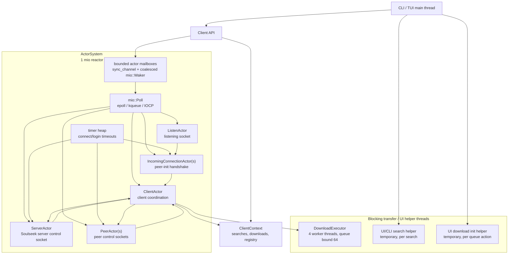

# Architecture

This branch uses one `mio` reactor per connected `Client` for long-lived
Soulseek control traffic. Actors remain the application-level model, but they
are state machines scheduled by socket readiness, mailbox wakeups, and timers
instead of long-running jobs pinned to worker threads.

Blocking file transfers are isolated behind a bounded download executor. That
keeps blocking `std::net::TcpStream` transfer code off the reactor without
creating one thread per transfer.

Shared mutable client state is mutated by `ClientActor` where practical. Worker
threads send status updates back to the actor instead of writing download state
directly, so coordination stays on the same path as peer and server events.



## Threads

Thread counts below are application-created threads in this codebase. Runtime
or dependency internals are not included.

| Thread source | Count | Lifetime | Notes |
| --- | ---: | --- | --- |
| Main CLI/TUI thread | 1 | process lifetime | Owns CLI/TUI control flow. |
| `ActorSystem` reactor | 1 per `Client` | client lifetime | Owns `ClientActor`, `ServerActor`, `PeerActor`, `ListenActor`, and incoming peer-init actors for that client. |
| Download executor | 4 per connected `Client` | client lifetime | Bounded blocking workers for `DownloadPeer::download_file`; queue bound is 64 jobs. |
| CLI/TUI search helper | 0 or 1 per active search action | search timeout/cancel lifetime | Keeps the UI responsive while `Client::search_with_cancel` waits. |
| UI download init helper | 0 or 1 per queue action | short-lived | Starts download records and passes receivers back to UI state. |

Typical interactive client with listening enabled and no active UI helper work:

```text
1 main thread
+ 1 actor reactor thread
+ 4 download executor workers
= 6 long-lived application threads
```

With listening disabled:

```text
1 main thread
+ 1 actor reactor thread
+ 4 download executor workers
= 6 long-lived application threads
```

Activity no longer adds one thread per peer or one thread per transfer. Peer
control sockets, the listening socket, and incoming peer-init handshakes share
the reactor. File transfers are capped by the bounded download executor, so at
most 4 transfers run concurrently per connected `Client`; additional transfer
work waits in the bounded queue or is failed when that queue is full.

## Reactor Scheduling

External actor messages use bounded mailboxes with a capacity of 1024 messages.
Each actor has a coalesced wake flag, so repeated sends enqueue at most one
ready token until the reactor drains that actor. The reactor drains at most 64
mailbox messages from one actor before rescheduling it, which prevents a hot
mailbox from starving socket readiness or timers.

Actors expose an I/O generation counter. The reactor only re-registers socket
interests when that generation changes, avoiding needless `mio` registration
churn after actions that did not change readable or writable interest.

## Coordination Boundaries

`ClientActor` owns cross-cutting client coordination:

- search requests are started through `ClientActor`, then completed from actor
  ticks on timeout or cancellation;
- download workers report status changes back to `ClientActor`;
- accepted peer sockets are parsed by short-lived `IncomingConnectionActor`
  instances before being handed to peer or file-transfer paths.

The remaining intentional blocking boundary is file transfer I/O. Keeping it in
`DownloadExecutor` avoids a broad rewrite of the transfer protocol while still
putting a hard cap on concurrent blocking work.
