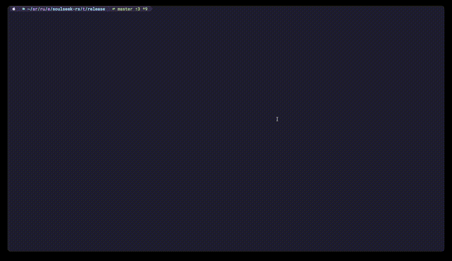

# Soulseek-rs 🦀

## ⚠️WARNING THIS IS UNDER DEVELOPMENT AND NOT READY FOR USE ⚠️

Souleek-rs is an experimental Soulseek library and client built in Rust. It's
under development and not yet ready for use. Soulseek is a closed-source P2P
file-sharing network from the 2000s. It's still used by music enthusiasts
around the world to share niche music.

## 🎥 Demo



## Project Goals

This project is a learning exercise to explore Rust. I've been using Soulseek
since the early 2000s, so it's close to my heart, and the Soulseek protocol is
a closed-source network protocol that provides a great opportunity to learn
about asynchronous and concurrent network programming and reverse engineering

It's not intended to be a production-ready client (yet).

Since it's a learning project, I have a self-imposed restriction not to use
external dependencies in the library. This means I can't use any external
crates that are not part of the Rust standard library. This is a good challenge
to learn how to build complex systems with only the standard library.

In the client crate, external dependencies are allowed for building a rich
experience. For me, this is a good balance between learning and practicality.

## Planned Features

- [x] Search for files
- [x] Download files
- [x] Configure credentials
- [x] TUI for searching and downloading files
- [x] Configure download & upload directories
- [x] Share files
- [x] Browse user(s) files
- [x] Chat in chatrooms
- [x] Private messaging
- [ ] Headless mode daemon mode with remote control

## Project Structure

This project is organized as a Cargo workspace with two crates:

- **soulseek-rs-lib** - The core library implementing the Soulseek protocol
- **soulseek-rs** - A CLI client built on top of the library

This structure allows:

- Other developers to build custom Soulseek clients using `soulseek-rs-lib`
- Users to install the ready-made client via `cargo install soulseek-rs`
- Clean separation of concerns between protocol implementation and user interface

## Installation

### For Users

```bash
cargo install soulseek-rs
```

### For Developers

Clone and build from source:

```bash
git clone git@github.com:michel/soulseek-rs.git
cd soulseek-rs
cargo build --release
```

The binary will be available at `target/release/soulseek-rs`.

### For Library Users

To build your own Soulseek client, add to your `Cargo.toml`:

```toml
[dependencies]
soulseek-rs-lib = "0.1.0"
```

## Usage

```bash
./target/release/soulseek-rs "the weeknd Blinding Lights"
```

### Private messages

Send a private message to another user from the command line:

```bash
soulseek-rs message <username> "hello there"
```

In the interactive TUI:

- press `m` to compose — type `<recipient> <message>` and `Enter` to send;
- press `i` to open the inbox popup listing sent and received messages
  (incoming messages arrive automatically while the TUI is open). The `i`
  shortcut shows an unread counter, e.g. `i inbox (3)`.

### Chat rooms

From the command line:

```bash
soulseek-rs rooms                       # list public rooms with user counts
soulseek-rs chat <room>                 # join and print messages for a while
soulseek-rs chat <room> "hello room"    # join, say one message, and exit
```

In the interactive TUI, press `c` to open the chat-rooms popup:

- the **room list** is browsable and `/`-filterable and shows each room's
  user count (busiest first); press `Enter` to join the highlighted room;
- several rooms can be **open at once** as tabs — `Tab`/`Shift-Tab` switch
  between them, `x` leaves the active room, `l` returns to the room list;
- in a room, press `Enter` to type a message and `Enter` again to send;
- the room's **member list** is selectable with `↑`/`↓`; press `b` to browse
  the highlighted user's shared files or `m` to send them a private message;
- **unread messages** bold a room's tab and add a `room (n)` badge, and the
  `c chat (n)` shortcut counts unread across all open rooms.

### Connectivity (being reachable)

Browsing and downloading are peer-to-peer, so at least one side must accept an
incoming connection. When the listener is enabled (the default), the client
**automatically tries to open its listen port** on your router via **UPnP-IGD**
and **NAT-PMP**, so firewalled peers and the server can connect back to you.
This is best-effort: if your router has UPnP/NAT-PMP disabled it's a no-op and
you'll see a log line suggesting you forward the port manually.

- The mapped/forwarded port is your `--listener-port` (env `LISTENER_PORT`,
  default `2234`); it is renewed automatically and removed on exit.
- If auto-mapping can't get that exact port, forward **TCP 2234** (or whatever
  `--listener-port` you chose) to this machine on your router.
- Pass `--disable-listener` to turn the listener (and port mapping) off.

Check whether it works on **your** network without launching the whole client:

```bash
soulseek-rs portmap
```

It tries to open the port via UPnP/NAT-PMP and prints whether your router
allowed it (and your external address), then removes the test mapping. If it
reports failure, enable UPnP on your router or forward the port manually.

If both you and a peer are behind routers with no forwarded port, browsing that
peer can't work — that's a fundamental Soulseek/peer-to-peer limitation, not a
bug.

## Development

To run the project in development mode with debug output and trace output:

```bash
RUST_LOG=trace cargo run
```

## Development

To run the tests:

```bash
cargo test
```

To run the linter:

```bash
cargo clippy
```

To run the formatter:

```bash
cargo fmt
```

### End-to-end tests

The `soulseek-rs-lib/tests/e2e.rs` suite exercises the client against a real
Soulseek server using [soulfind](https://github.com/soulfind-dev/soulfind), a
local server implementation. The tests are **server-optional**: they run when a
server is available and otherwise skip (so `cargo test` stays green everywhere).

They locate a server in this order:

1. `SOULSEEK_TEST_SERVER=host:port` — connect to an already-running server, or
2. `SOULFIND_BIN=/path/to/soulfind` (or a `soulfind/bin/soulfind` checkout in a
   parent directory) — spawn soulfind on an ephemeral port with a throwaway
   database.

```bash
# Build soulfind once (see its BUILDING.md), then:
SOULFIND_BIN=/path/to/soulfind/bin/soulfind \
  cargo test -p soulseek-rs-lib --test e2e -- --nocapture
```

> On macOS, soulfind's `SQLITE_CONFIG_SINGLETHREAD` optimization is rejected by
> the system SQLite; building soulfind with that call made non-fatal lets it run
> locally. It is only a mutex optimization and does not affect the server.

Set `SOULSEEK_E2E_REQUIRED=1` to turn a missing server into a hard failure
instead of a skip. Continuous integration sets it so the e2e suite genuinely
runs against a freshly built soulfind rather than silently skipping.

### Continuous integration

`.github/workflows/ci.yml` runs on every push and pull request:

- **Format & Clippy** — `cargo fmt --all --check` and
  `cargo clippy --workspace --all-targets -- -D warnings`.
- **Test** — builds soulfind from source (LDC + `dub build :server`), points
  `SOULFIND_BIN` at it, and runs `cargo test --workspace` with
  `SOULSEEK_E2E_REQUIRED=1`, so unit and end-to-end tests both run.

## License

This project is licensed under the MIT License — see the [LICENSE](./LICENSE)
file for details.
