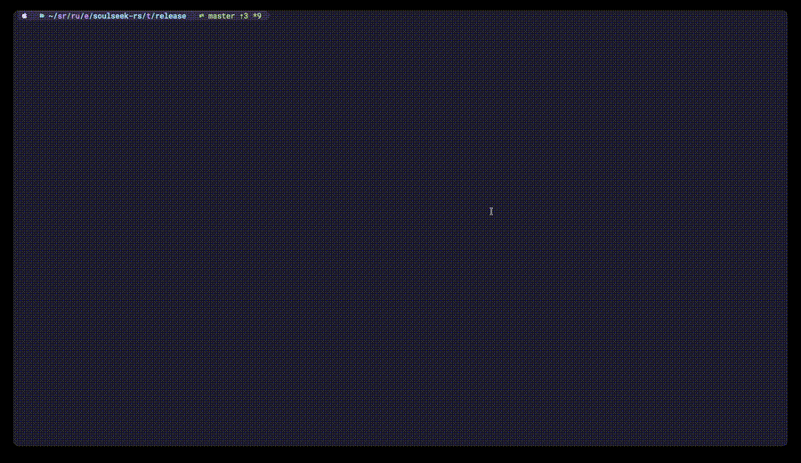

<div align="center">
  <picture>
    <source media="(prefers-color-scheme: dark)" srcset="fixtures/logo-ink.svg">
    
  </picture>
</div>

# Soulseek-rs 🦀

**A soulseek client for the terminal. Built for agents and people who live
there.**

Search the network, share your files, browse someone's collection, join a room.
It runs over ssh on the machine where your music already lives.

Soulseek is a closed-source P2P file-sharing network from the 2000s, still used
by music enthusiasts around the world to share niche music. This repository is
that client plus [`soulseek-rs-lib`](./soulseek-rs-lib), the protocol library it
is built on.

**[re-invention.nl/soulseek-rs](https://re-invention.nl/soulseek-rs/)**: what it
does, how to install it, and every `config.toml` setting.

## 🎥 Demo



## Features

- **Search & download**: search the network and queue downloads in the TUI,
  or fetch a track in one command with `get`
- **Sharing**: `shares add` a directory and your files show up in searches;
  `serve` stays online so peers can browse and download them
- **Browse**: list any user's shared files and download straight from the tree
- **Chat rooms**: list, join, and talk in public rooms, several open at once
- **Private messages**: send and receive messages, with an inbox in the TUI
- **Firewalled peers**: downloads and browsing fall back to server-brokered
  connections when a peer can't be reached directly
- **Automatic port mapping**: opens your listen port via UPnP-IGD and
  NAT-PMP, with a `portmap` subcommand to test your router
- **TUI and CLI**: a full terminal interface, plus a one-shot command surface
  built for scripts and agents, where every feature is reachable without a
  terminal, stdout carries records only, and the exit code says what happened

## Project Goals

This project is a learning exercise to explore Rust. I've been using Soulseek
since the early 2000s, so it's close to my heart, and the Soulseek protocol is
a closed-source network protocol that provides a great opportunity to learn
about asynchronous and concurrent network programming and reverse engineering

Since it's a learning project, I have a self-imposed restriction not to use
external dependencies in the library. This means I can't use any external
crates that are not part of the Rust standard library. This is a good challenge
to learn how to build complex systems with only the standard library.

In the client crate, external dependencies are allowed for building a rich
experience. For me, this is a good balance between learning and practicality.

## Planned Features

- [ ] Headless mode daemon mode with remote control

## Project Structure

This project is organized as a Cargo workspace with two crates:

- **soulseek-rs-lib** - The core library implementing the Soulseek protocol
- **soulseek-rs** - A CLI client built on top of the library

This structure allows:

- Other developers to build custom Soulseek clients using `soulseek-rs-lib`
- Users to install the ready-made client via `cargo install soulseek-rs`
- Clean separation of concerns between protocol implementation and user interface

## Installation

### For Users

Homebrew, on macOS or Linux — a prebuilt binary, no Rust toolchain:

```bash
brew install michel/tap/soulseek-rs
```

Or with cargo:

```bash
cargo install soulseek-rs
```

### For Developers

Clone and build from source:

```bash
git clone git@github.com:michel/soulseek-rs.git
cd soulseek-rs
cargo build --release
```

The binary will be available at `target/release/soulseek-rs`.

### For Library Users

To build your own Soulseek client, add to your `Cargo.toml`:

```toml
[dependencies]
soulseek-rs-lib = "6"
```

## Usage

Run it with no subcommand for the interactive TUI:

```bash
soulseek-rs
```

Everything else is a one-shot command that runs headless.

### Scripting

The one-shot commands follow three rules, so they compose with other tools:

- **stdout is data.** One record per line, and nothing else. Progress,
  warnings, and errors go to stderr; `--quiet` silences the progress.
- **`--json` emits newline-delimited JSON**, one object per line. Without it,
  records are tab-separated fields with no header and no decoration.
- **The exit code is the verdict.** No output plus exit 0 never means failure.

| Code | Meaning |
| ---- | ------- |
| 0 | success |
| 1 | unexpected error |
| 2 | bad arguments, missing credentials, unusable configuration |
| 3 | could not reach the server, or the login was rejected |
| 4 | the command worked but found nothing |
| 5 | timed out waiting for a response or a transfer |
| 6 | a transfer started but did not finish |

#### Commands

```bash
soulseek-rs search <QUERY>                # print matching files
soulseek-rs download <USER> <PATH>        # fetch one known file
soulseek-rs download --stdin              # fetch files listed on stdin
soulseek-rs get <QUERY>                   # search, pick, and download
soulseek-rs browse <USER>                 # list a user's shared files
soulseek-rs room list                     # public rooms and user counts
soulseek-rs room say <ROOM> <MESSAGE>     # post to a room
soulseek-rs room listen <ROOM>            # stream room messages and joins
soulseek-rs message send <USER> <TEXT>    # send a private message
soulseek-rs message read                  # stream incoming private messages
soulseek-rs room users <ROOM>             # who is in a room
soulseek-rs serve [--follow]              # stay online sharing, stream uploads
soulseek-rs whoami                        # confirm credentials and connection
soulseek-rs user <NAME>                   # a peer's status and share counts
soulseek-rs shares list|add|remove|status|reindex
soulseek-rs config path|list|get|set
soulseek-rs portmap                       # test automatic port mapping
soulseek-rs skills install|uninstall|list # teach a coding agent this CLI
```

`whoami`, `config` and `shares list|add|remove` are the ones a script runs
first: the config commands need no account at all, and `whoami` answers
"are these credentials good and what am I offering" in one call.

Eleven of these need no credentials, because they never touch the network:
`config path|list|get|set`, `shares list|add|remove`, `portmap` and
`skills install|uninstall|list`. Note that
`shares status` and `shares reindex` are not among them, because they report
what the network will actually see, which means logging in and letting the
library scan the folders.

Every command emits records except the four that perform an action.
`room say`, `message send`, `shares add` and `shares remove` say nothing on
stdout and answer with their exit code alone. `room listen`, `message read`
and `serve` stream records as they arrive, until `--duration` seconds pass or,
with `--follow`, until they are interrupted.

#### Record shapes

Text mode puts the identifying fields first and the remote path last, because
a path may contain anything except a tab (tabs and newlines in peer-supplied
text are replaced with spaces so a record is always exactly one line):

```
search           user   size    bitrate         path
browse           user   size    path
download / get   local-path
room list        users  room
room users       user
room listen      type   room    user            message
message read     timestamp      user            message
serve            status user    sent/size       path
user             user   status  average-speed   shared-files
whoami           user   server  shared-folders  shared-files
shares list      ok|missing     directory
shares status    folders        files
config get|set|list|path        key             value
portmap          ok|failed      backend         external
```

`room listen`'s `type` is `message`, `join` or `leave`; a join or leave leaves
the message field empty. `serve`'s `status` is `uploading`, `completed`,
`cancelled` or `failed`. `user`'s `status` is `online`, `away` or `offline`,
and any field the server did not answer prints as `-`.

`--json` carries more than text does, because an object has room for fields a
column layout does not: `search` adds `duration`, `slots`, `speed` and
`free_slot`; `browse` adds `directory`; `download` adds the `user`, remote
`path` and `size` alongside the local `file`; `whoami` adds `listening`,
`listen_port` and `download_dir`; `user` adds `privileged` and
`shared_folders`; `shares status` adds the `directories` array; `serve` adds
`bytes_sent`, `size`, `speed` and a `reason` on failure; `portmap` adds
`port`. Fields the server never answered are `null` rather than absent, so a
missing reply cannot be misread as a zero.

`download --stdin` reads back either shape it emits: a JSON object per line,
or tab-separated text whose first field is the user and last field is the
path. That is why `search` and `browse` pipe straight into it.

#### Recipes

```bash
# Everything above 320kbps from peers with a free slot, best first
soulseek-rs search "aphex twin xtal" --min-bitrate 320 --free-slots

# One command, start to finish: search, pick the best, download it
soulseek-rs get "aphex twin xtal"

# Filter with jq, then fetch what survived
soulseek-rs search "rjd2" --json \
  | jq -c 'select(.size > 5000000 and .free_slot)' \
  | soulseek-rs download --stdin

# Grab a peer's whole FLAC folder
soulseek-rs browse someuser | grep -i '\.flac$' | soulseek-rs download --stdin

# Branch on the outcome
if soulseek-rs get "some rare track" --quiet; then
  echo "got it"
elif [ $? -eq 4 ]; then
  echo "nobody has it"
fi

# Log room chat as JSON until interrupted
soulseek-rs room listen lobby --follow --json >> lobby.ndjson

# Be a peer: share a folder and log every upload served
soulseek-rs shares add ~/Music
soulseek-rs serve --follow --json | tee -a uploads.ndjson

# Decide whether a peer is worth queueing to before committing
soulseek-rs user someuser --json | jq -e '.status != "offline"'
```

### Agent skills

The scriptable surface above is meant to be driven by coding agents as much as
by shell scripts, but `--help` cannot tell an agent which JSON keys a record
carries or what exit 4 means. That lives in a skill file shipped inside the
binary, so a `cargo install` is all you need to hand it to your agent:

```bash
soulseek-rs skills install
```

That writes `SKILL.md` into every agent it finds in your home directory,
currently Claude Code (`~/.claude/skills`) and opencode
(`~/.config/opencode/skill`), and prints one record per target:

```
installed   claude     /home/you/.claude/skills/soulseek-rs/SKILL.md
unchanged   opencode   /home/you/.config/opencode/skill/soulseek-rs/SKILL.md
```

Running it again is how you update after upgrading the binary; an identical
copy reports `unchanged` rather than rewriting it. `skills list` shows what is
there without touching anything, and `skills uninstall` removes it again, but
only when the file it finds is the one this binary wrote.

For an agent this table does not cover, name the directory yourself, or commit
the skill next to a project so everyone working on it gets the same brief:

```bash
soulseek-rs skills install --dir ~/.config/some-agent/skills
soulseek-rs skills install --dir .claude/skills   # commit it with the repo
```

### Sharing

`serve` is the mode that makes this client a source: it stays logged in, keeps
the listener and the share index alive, answers searches and browse requests
from the network, and prints one record per upload as it changes state
(`uploading`, `completed`, `cancelled`, `failed`). It ends after `--duration`
seconds (an hour by default), or runs until interrupted with `--follow`.

```bash
soulseek-rs shares add ~/Music     # remembered in config.toml
soulseek-rs shares status          # what the network will actually see
soulseek-rs shares reindex         # after adding files on disk
soulseek-rs serve --follow
```

Uploads are only visible inside a running `serve`, because every other command
is a short-lived process with nothing to serve, so there is no separate
`uploads list`. Managing transfers across commands (pause, resume, a queue
that outlives one invocation) needs the resident daemon that `serve` would
grow into; it is not there yet.

Downloads run under a deadline (`--timeout`, 300s by default) and
`--max-concurrent-downloads` at a time, so an unattended run always ends.

### Configuration

Every setting can come from a flag, an environment variable, or the config
file, in that order of precedence. Flags work before or after the subcommand.

| Flag | Environment variable | `config.toml` key | Default |
| ---- | -------------------- | ----------------- | ------- |
| `--username` | `SOULSEEK_USERNAME` | `username` | required |
| `--password` | `SOULSEEK_PASSWORD` | never stored in the file | required |
| `--password-cmd` | `SOULSEEK_PASSWORD_CMD` | `password_cmd` | unset |
| `--server` | `SOULSEEK_SERVER` | `server` | `server.slsknet.org:2416` |
| `--download-dir` | `SOULSEEK_DOWNLOAD_DIR` | `download_dir` | `<Downloads>/Soulseek` |
| `--shared-dir` (repeatable) | `SOULSEEK_SHARED_DIR` | `shared_dir` / `shared_dirs` | the download dir |
| `--listener-port` | `SOULSEEK_LISTENER_PORT` | `listener_port` | `2234` |
| `--no-listener` / `--listener` | `SOULSEEK_NO_LISTENER` | `disable_listener` | listener on |
| `--max-concurrent-downloads` | `SOULSEEK_MAX_CONCURRENT_DOWNLOADS` | `max_concurrent_downloads` | `5` |
| `--search-timeout` | `SOULSEEK_SEARCH_TIMEOUT` | `search_timeout` | `10` |
| `--log-file` | `SOULSEEK_LOG_FILE` | not a config key | stderr |

Boolean environment variables accept the usual `1`/`0`/`true`/`false`/`yes`/`no`.
`--config <FILE>` (or `SOULSEEK_CONFIG`) reads a different config file and
`--no-config` ignores it entirely, which is what an isolated or containerised
run wants. The config file lives at `~/.config/soulseek-rs/config.toml` on
macOS and Linux; `SOULSEEK_CONFIG_DIR` and `SOULSEEK_STATE_DIR` relocate the
config and state directories wholesale. Every variable above is also read from
a `.env` file in the working directory, which is often the tidiest way to hand
a container its credentials.

`config get` and `config set` cover the nine settings the file can hold
(`username`, `server`, `listener_port`, `disable_listener`, `download_dir`,
`shared_dirs`, `max_concurrent_downloads`, `search_timeout`, `password_cmd`),
and name the lot back at you when you ask for something else. Setting a key to
an empty string clears it, and `shared_dirs` takes a comma-separated list.
Every wait expressed in seconds (`--search-timeout`, each `--timeout`, each
`--duration`) is bounded to one day, so a mistyped flag is rejected rather than
hanging until the heat death of the universe.

#### Credentials for unattended runs

Four ways to supply a password, in the order they are consulted:

1. `--password-stdin`: read the first line of stdin, like `docker login`.
2. `--password` / `SOULSEEK_PASSWORD`: convenient, but visible in `ps`.
3. The **OS keychain** (macOS Keychain, Windows Credential Manager, Linux
   Secret Service), under service `soulseek-rs` and your username. The TUI
   stores your password here after a successful login.
4. `password_cmd` / `--password-cmd`: a shell command whose stdout is the
   password, e.g. `pass show soulseek`. Best for headless boxes with no
   keychain.

```bash
# Nothing sensitive on the command line or in the environment
pass show soulseek | soulseek-rs --username alice --password-stdin get "some track"
```

Logging stays at errors only unless you ask for more: `-v` through `-vvvv`
raise it, and `LOG_LEVEL`/`RUST_LOG` are honoured when no `-v` is given.
`NO_COLOR` and a non-terminal stderr both disable colour.

### Private messages

Send and read private messages from the command line:

```bash
soulseek-rs message send <username> "hello there"
soulseek-rs message read --duration 60      # or --follow to run until killed
```

In the interactive TUI:

- press `m` to compose, then type `<recipient> <message>` and `Enter` to send;
- press `i` to open the inbox popup listing sent and received messages
  (incoming messages arrive automatically while the TUI is open). The `i`
  shortcut shows an unread counter, e.g. `i inbox (3)`.

### Chat rooms

From the command line:

```bash
soulseek-rs room list                     # public rooms with user counts
soulseek-rs room listen <room>            # stream messages, joins, and leaves
soulseek-rs room say <room> "hello room"  # post one message and exit
```

In the interactive TUI, press `c` to open the chat-rooms popup:

- the **room list** is browsable and `/`-filterable and shows each room's
  user count (busiest first); press `Enter` to join the highlighted room;
- several rooms can be **open at once** as tabs: `Tab`/`Shift-Tab` switch
  between them, `x` leaves the active room, `l` returns to the room list;
- in a room, press `Enter` to type a message and `Enter` again to send;
- the room's **member list** is selectable with `↑`/`↓`; press `b` to browse
  the highlighted user's shared files or `m` to send them a private message;
- **unread messages** bold a room's tab and add a `room (n)` badge, and the
  `c chat (n)` shortcut counts unread across all open rooms.

### Connectivity (being reachable)

Browsing and downloading are peer-to-peer, so at least one side must accept an
incoming connection. When the listener is enabled (the default), the client
**automatically tries to open its listen port** on your router via **UPnP-IGD**
and **NAT-PMP**, so firewalled peers and the server can connect back to you.
This is best-effort: if your router has UPnP/NAT-PMP disabled it's a no-op and
you'll see a log line suggesting you forward the port manually.

- The mapped/forwarded port is your `--listener-port` (env
  `SOULSEEK_LISTENER_PORT`, default `2234`); it is renewed automatically and
  removed on exit.
- If auto-mapping can't get that exact port, forward **TCP 2234** (or whatever
  `--listener-port` you chose) to this machine on your router.
- Pass `--no-listener` to turn the listener (and port mapping) off, or
  `--listener` to force it on when the config file disables it.

Check whether it works on **your** network without launching the whole client:

```bash
soulseek-rs portmap            # exits 0 when mapping works, 4 when it does not
soulseek-rs portmap --json     # {"ok":true,"backend":"upnp","external":"…"}
```

It tries to open the port via UPnP/NAT-PMP, reports whether your router allowed
it (and your external address), then removes the test mapping. Because the
verdict is in the exit code, `soulseek-rs portmap || notify-me` works as a
health check.

If both you and a peer are behind routers with no forwarded port, browsing that
peer can't work. That's a fundamental Soulseek/peer-to-peer limitation, not a
bug.

## Development

To run the project in development mode with debug output and trace output:

```bash
RUST_LOG=trace cargo run
```

To run the tests:

```bash
cargo test
```

To run the linter:

```bash
cargo clippy
```

To run the formatter:

```bash
cargo fmt
```

### End-to-end tests

Two suites exercise the client against a real Soulseek server using
[soulfind](https://github.com/soulfind-dev/soulfind), a local server
implementation: `soulseek-rs-lib/tests/e2e.rs` covers the protocol library, and
`soulseek-rs/tests/cli_e2e.rs` drives the actual binary the way a script would
(records on stdout, exit codes, real searches, downloads, and chat). The tests
are **server-optional**: they run when a server is available and otherwise skip
(so `cargo test` stays green everywhere).

They locate a server in this order:

1. `SOULSEEK_TEST_SERVER=host:port`: connect to an already-running server, or
2. `SOULFIND_BIN=/path/to/soulfind` (or a `soulfind/bin/soulfind` checkout in a
   parent directory), which spawns soulfind on an ephemeral port with a
   throwaway database.

```bash
# Build soulfind once (see its BUILDING.md), then:
SOULFIND_BIN=/path/to/soulfind/bin/soulfind \
  cargo test --workspace -- --nocapture
```

> On macOS, soulfind's `sqlite3_config` call is rejected by the system SQLite
> and the server dies at startup with `SQLite error 7 (out of memory)`, which
> the suite reports as a skip. Run the tests with
> `DYLD_LIBRARY_PATH=/opt/homebrew/opt/sqlite/lib` so soulfind picks up
> Homebrew's SQLite instead; no patching needed.

Set `SOULSEEK_E2E_REQUIRED=1` to turn a missing server into a hard failure
instead of a skip. Continuous integration sets it so the e2e suite genuinely
runs against a freshly built soulfind rather than silently skipping.

### Continuous integration

`.github/workflows/ci.yml` runs on every push and pull request:

- **Format & Clippy**: `cargo fmt --all --check` and
  `cargo clippy --workspace --all-targets -- -D warnings`.
- **Test**: `cargo test --verbose` on Linux, macOS, and Windows.
- **End-to-end**: builds soulfind from source (LDC + `dub build :server`),
  points `SOULFIND_BIN` at it, and runs both the library and CLI e2e suites
  with `SOULSEEK_E2E_REQUIRED=1`, so a missing server fails instead of skipping.

## License

This project is licensed under the MIT License. See the [LICENSE](./LICENSE)
file for details.
